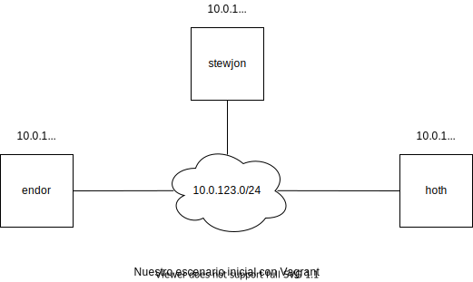
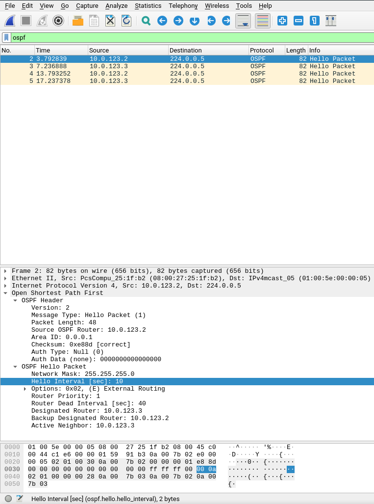
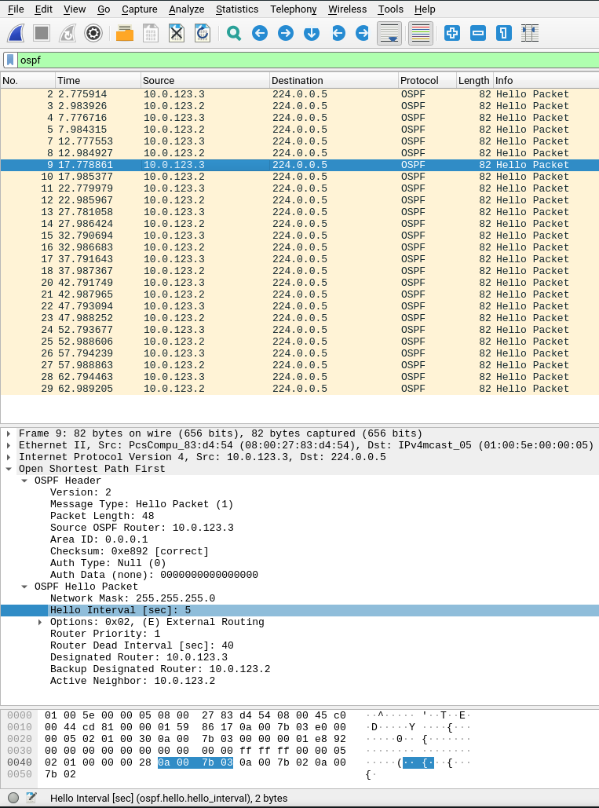

# Configuración y administración de redes
A través de esta práctica pretendemos conocer cómo se configuran y gestionan las redes de comunicaciones basadas en tecnología `IP`. Para ello hemos preparado un escenario tal y como se indica en el guión proporcionado. No obstante y dado que vamos a trabajar única y exclusivamente a través de la línea de comandos con nuestros equipos hemos preferido emplear `vagrant` para facilitar el montaje y la reproducibilidad de nuestro trabajo. En el anexo se puede encontrar una pequeña guía de esta herramienta igual que la que incluíamos en la práctica anterior así como el `Vagrantfile` que empleamos nosotros.

Asimismo y dado que somos fans de *Star Wars* hemos optado por cambiar los nombres de las máquinas ya que creemos que ésto no solo hace más entretenida la realización de las tareas propuestas sino que de veras pensamos que facilitará la redacción del informe una vez que el lector se familiarice con los *hostnames* escogidos. La primera máquina virtual se llama `endor`, el planeta en el que residen los *ewoks* sobre el que se desarrolla el final del *Episodio 6: El Retorno del Jedi*. El segundo equipo será `hoth`, el planeta helado en el que el Imperio asaltó la base rebelde en el *Episodio 5: El Imperio Contraataca*. La subred a la que pertenecen ambas máquinas es la `10.0.123.0/24` siendo la *IP* de `endor` la `10.0.123.2` y la de `hoth` la `10.0.123.3`. Señalamos asimismo que la máquina anfitrión también tiene su propia *IP* en esta subred en caso de que necesitemos conectividad con ella en algún momento. Nuestro propio ordenador tiene asignada la dirección `10.0.123.1`. Adjuntamos un pequeño esquema que resume todo para que pueda ser consultado en el futuro. Señalamos que el *hostname* de nuestra máquina, es, como no podría ser de otra manera, otro planeta de esa galaxia muy muy lejana, `stewjon`. Con todo, la topología queda:

<p align="center">
  
</p>

## Aclaraciones

### Privilegios necesarios
Señalamos que, al igual que en el guión de la práctica no añadiremos `sudo` al inicio de todos los comandos en aras de una mayor claridad. Como norma general podemos establecer que todos aquellos comandos que vayan a modificar una configuración de red necesitarán ser privilegiados mientras que aquellos que muestren el estado del equipo no lo necesitan. Esto es, si invocamos a `ip addr add` o `ip route add` tendremos que hacerlo a través de `sudo`, cosa que no es cierta para `ip a` o `ip r`. En aquellos casos que creemos que pueden llevar a error incluiremos un comentario aclarando los permisos necesarios. Asimismo, en los comandos en los que se incluyan los inductores o *prompts* se necesitarán permisos de superusuario si se incluye el carácter `#` y éstos no serán necesarios si aparece `$`.

### La notación *CIDR*
La suite `iproute2` es capaz de interpretar direcciones *IP* junto a sus máscaras de subred dadas en formato [*CIDR*](https://en.wikipedia.org/wiki/Classless_Inter-Domain_Routing#CIDR_notation). Ésto permite un uso compacto de sus herramientas y una gran densidad de información en la salida de sus comandos.

### Sobre `traceroute`
Tal y como se comenta en el guión de la práctica, `traceroute` es una herramienta tremendamente útil en el diagnóstico de redes. No obstante y dado que entre las máquinas de nuestro escenario no media ningún encaminador de capa 3, es decir, ningún *router*, la salida de este comando nos es de muy poca utilidad. Al pertenecer ambas máquinas a la misma subred solo hay un salto entre ellas con lo que la salida se `traceroute` será siempre una única línea. Es por ello que no lo hemos incluido en ninguna de nuestras pruebas de conectividad ya que no creemos que proporcionen ninguna información adicional a la que nos suministran los `ping`s que empleamos para cerciorarnos de una correcta configuración de los equipos.

## Tarea 1: Cambiando las primeras direcciones
Vamos a realizar estos cambios en `endor` así que lo primero que debemos hacer es conectarnos a ella con `vagrant ssh endor`. Una vez dentro ejecutaremos `ip addr show` o `ip a`, ya que son equivalentes. Señalamos que muchos de los comandos de la suite `iproute2` pueden abreviarse, cosa que haremos con órdenes frecuentemente utilizadas como es el caso de `ip a`.

Al hacerlo veremos que en nuestra máquina tenemos `3` interfaces. Señalamos que los nombres son idénticos en ambas máquinas:

- `lo`: Es la interfaz de `loopback`, esto es, la dirección a través de la cual nos podemos referir a nuestra propia máquina. Inicialmente tiene asignadas las direcciones `127.0.0.1/8` y `::1 == 0:0:0:0:0:0:0:1` relativas a los protocolos `IPv4` e `IPv6`, respectivamente.

- `enp0s3`: Interfaz `Ethernet` perteneciente a una red interna de *VirtualBox* que carece de importancia para nosotros.

- `enp0s8`: Interfaz de `Ethernet` que pertenece a la subred que nosotros hemos configurado y que incluye a ambas máquinas virtuales. Actualmente contiene las direcciones `10.0.123.2/24` y `fe80::a00:27ff:fe25:1fb2/64`. Esta última es una *dirección de enlace-local*. Comentaremos algo más acerca de esta clase de dirección `IPv6` [aquí](#una-pequeña-nota-comparando-las-direcciones-ipv4-e-ipv6).

Asimismo, una inspección más concienzuda de las direcciones de la interfaz de `loopback` nos revela el `scope` o `ámbito` de estas direcciones. Recordemos que la interfaz de `loopback` nace para que programas residentes en la máquina puedan comunicarse entre sí a través de la pila de protocolos `TCP/IP`. Ésto permite, por ejemplo, ejecutar una base de datos con una interfaz `HTTP` y un agente recolector de datos en un mismo equipo. Es por ello que normalmente el ámbito de las direcciones será local o será `host` para la suite `iproute2`. Cuando nosotros configuremos una dirección para que se pueda alcanzar esta subred desde fuera querremos que el ámbito no sea `host` sino que sea `global` con lo que la dirección sería válida más allá de la propia máquina. Si no especificamos lo contrario el ámbito será `global`. Podemos encontrar información relativa a este ámbito en la línea `64` de `man ip-address`. Para explicitar que queremos un ámbito de `host` ejecutaríamos por ejemplo lo siguiente:

```bash
ip addr add 10.10.1.1/32 dev lo scope host
```

No obstante, en la siguiente tarea veremos cómo, aunque una de las direcciones de la interfaz de `loopback` tenga un ámbito de `host`, sí que es visible a la otra máquina... Tras indagar por Internet llegamos a [este](http://linux-ip.net/html/tools-ip-address.html#tb-tools-ip-addr-scope) enlace en el que se da a entender que si el ámbito es `host` no se debe encaminar esa dirección fuera de la máquina pero por lo visto no se deniega que el tráfico entrante llegue hasta ella... No sabemos si es un fallo de la implementación o si verdaderamente se desea que se comporte el sistema así. En principio este ámbito puede ayudar a seleccionar la dirección a "estampar" en los paquetes de salida en casos en los que una interfaz tenga varias direcciones asociadas. No obstante, si tenemos la definición en mente desde luego consideramos que lo más correcto es que el ámbito de estas direcciones sea `global` así que es lo que aplicaremos en todos los casos en los que sea pertinente.

Con todo, para asignar las direcciones pedidas basta con ejecutar:
```bash
# Asignamos la dirección 10.10.5.5 con una máscara de 32 bits a la interfaz de loopback
endor# ip addr add 10.10.5.5/32 dev lo

# Asignamos la dirección 3ff::5 con una máscara de 122 bits a la interfaz enp0s8
endor# ip addr add 3ff::5/122 dev enp0s8
```

Tras estos comandos podemos comprobar con `ip a` que, en efecto, las direcciones que hemos añadido aparecen en sus respectivas interfaces. La salida de este comando es:

```bash
endor$ ip a
1: lo: <LOOPBACK,UP,LOWER_UP> mtu 65536 qdisc noqueue state UNKNOWN group default qlen 1000
    link/loopback 00:00:00:00:00:00 brd 00:00:00:00:00:00
    inet 127.0.0.1/8 scope host lo
       valid_lft forever preferred_lft forever
    inet 10.10.5.5/32 scope global lo
       valid_lft forever preferred_lft forever
    inet6 ::1/128 scope host 
       valid_lft forever preferred_lft forever
2: enp0s3: <BROADCAST,MULTICAST,UP,LOWER_UP> mtu 1500 qdisc fq_codel state UP group default qlen 1000
    link/ether 02:92:c5:21:58:89 brd ff:ff:ff:ff:ff:ff
    inet 10.0.2.15/24 brd 10.0.2.255 scope global dynamic enp0s3
       valid_lft 85793sec preferred_lft 85793sec
    inet6 fe80::92:c5ff:fe21:5889/64 scope link 
       valid_lft forever preferred_lft forever
3: enp0s8: <BROADCAST,MULTICAST,UP,LOWER_UP> mtu 1500 qdisc fq_codel state UP group default qlen 1000
    link/ether 08:00:27:25:1f:b2 brd ff:ff:ff:ff:ff:ff
    inet 10.0.123.2/24 brd 10.0.123.255 scope global enp0s8
       valid_lft forever preferred_lft forever
    inet6 3ff::5/122 scope global 
       valid_lft forever preferred_lft forever
    inet6 fe80::a00:27ff:fe25:1fb2/64 scope link 
       valid_lft forever preferred_lft forever
```

Para eliminar estas modificaciones basta con ejecutar:

```bash
# Eliminamos la dirección 10.10.5.5 con una máscara de 32 bits de la interfaz de loopback
endor# ip addr del 10.10.5.5/32 dev lo

# Eliminamos la dirección 3ff::5 con una máscara de 122 bits de la interfaz enp0s8
endor# ip addr del 3ff::5/122 dev enp0s8
```

Así, hemos logrado configurar y eliminar una dirección *IP* de cada una de las dos interfaces de interés. Destacamos que a la hora de asignar las direcciones podemos establecer la dirección de *broadcast* manualmente o a través del comodín `+`. Asignar la dirección de *broadcast* manualmente suele ser mala idea ya que se calcula de manera automática en base a la dirección *IP* y la máscara de subred que asignemos. De configurarla de manera incorrecta podríamos enfrentarnos a problemas de funcionamiento dado el uso que protocolos como *ARP* hacen de esta dirección en particular...

```bash
# Asignamos la dirección 10.0.0.1 y la dirección de broadcast 10.0.0.255 a la interfaz enp0s8
ip addr add 10.0.0.1/24 brd + dev enp0s8
```

Con todo listo por ahora pasamos a la siguiente tarea.

## Tarea 2: Configurando rutas estáticas

### Creando las subredes
Ya sabemos cómo asignar una dirección determinada a una interfaz. Es por ello que preparar las *subredes virtuales* soportadas por la interfaz de *loopback* es cuestión de ejecutar comandos totalmente análogos a los anteriores. Para facilitar la compresión de estas órdenes incluimos de nuevo un inductor (*prompt*) que indica el *hostname* de la máquina en la que se ejecuta. Con todo, creamos estas subredes de la siguiente manera:

```bash
# Creamos la subred 10.10.1.1/32 en endor
endor# ip addr add 10.10.1.1/32 dev lo

# Hacemos lo propio en hoth
hoth# ip addr add 10.0.2.1/32 dev lo
```

Si ejecutamos `ip a` para cerciorarnos de que todo es correcto observaremos lo siguiente:

```bash
endor$ ip a
1: lo: <LOOPBACK,UP,LOWER_UP> mtu 65536 qdisc noqueue state UNKNOWN group default qlen 1000
    link/loopback 00:00:00:00:00:00 brd 00:00:00:00:00:00
    inet 127.0.0.1/8 scope host lo
       valid_lft forever preferred_lft forever
    inet 10.10.1.1/32 scope host lo
       valid_lft forever preferred_lft forever
    inet6 ::1/128 scope host 
       valid_lft forever preferred_lft forever

hoth$ ip a
1: lo: <LOOPBACK,UP,LOWER_UP> mtu 65536 qdisc noqueue state UNKNOWN group default qlen 1000
    link/loopback 00:00:00:00:00:00 brd 00:00:00:00:00:00
    inet 127.0.0.1/8 scope host lo
       valid_lft forever preferred_lft forever
    inet 10.10.2.1/32 scope global lo
       valid_lft forever preferred_lft forever
    inet6 ::1/128 scope host 
       valid_lft forever preferred_lft forever
```

Señalamos que hemos omitido las demás interfaces de la salida porque por ahora no son de interés para nosotros...

### Instanciando las rutas
Para que exista conectividad entre estas subredes debemos instanciar explícitamente las rutas que las unan. Para ello debemos emplear el comando `ip route`. Al igual que ocurre con `ip addr`, podemos consultar la tabla de encaminamiento actual con `ip r` en vez de `ip route` lo que al final nos resulta más cómodo y rápido. Si ejecutamos dicho comando veremos cómo `endor` y `hoth` tratarán de alcanzar las subredes `10.10.2.1/32` y `10.10.1.1/32` a través del equipo con dirección `10.0.2.2`. Esta dirección es la que da salida a las máquinas a Internet por lo que los paquetes se encaminarán a través de este *gateway* en ausencia de una regla explícita... Para obtener esta información basta con inspeccionar las tablas de encaminamiento en cada uno de los dos equipos:

```bash
endor$ ip r
default via 10.0.2.2 dev enp0s3 proto dhcp src 10.0.2.15 metric 100  # La salida por defecto es a 10.0.2.2...
10.0.2.0/24 dev enp0s3 proto kernel scope link src 10.0.2.15
10.0.2.2 dev enp0s3 proto dhcp scope link src 10.0.2.15 metric 100
10.0.123.0/24 dev enp0s8 proto kernel scope link src 10.0.123.2

hoth$ ip r
default via 10.0.2.2 dev enp0s3 proto dhcp src 10.0.2.15 metric 100  # La salida por defecto es a 10.0.2.2...
10.0.2.0/24 dev enp0s3 proto kernel scope link src 10.0.2.15
10.0.2.2 dev enp0s3 proto dhcp scope link src 10.0.2.15 metric 100
10.0.123.0/24 dev enp0s8 proto kernel scope link src 10.0.123.3
```

Señalamos que las rutas a las subredes a las que pertenecen las interfaces se añaden por defecto. Éste es el ejemplo de la ruta a `10.0.123.0/24` en ambos equipos.

Nosotros sabemos que para alcanzar las subredes que hemos creado en las interfaces de *loopback* la pasarela debe ser la máquina opuesta. Esto es, `endor` debe encaminar sus paquetes a través de `hoth` y viceversa. Conociendo las direcciones de cada máquina en la red que las interconecta podemos simplemente instanciar las rutas que necesitamos con las siguientes órdenes. Recordamos que en la subred que une a ambos equipos, la *IP* de `endor` es la `10.0.123.2` y la de `hoth` la `10.0.123.3`. Con todo:

```bash
# Establecemos hoth como pasarela para los paquetes que vayan a 10.10.2.1
endor# ip route add 10.10.2.1/32 via 10.0.123.3

# Establecemos endor como pasarela para los paquetes que vayan a 10.10.1.1
hoth# ip route add 10.10.1.1/32 via 10.0.123.2
```

Con estos comandos se añaden las siguientes entradas a las tablas de `endor` y `hoth` respectivamente:

```bash
endor$ ip r
# La tabla anterior más...
10.10.2.1 via 10.0.123.3 dev enp0s8

hoth$ ip r
# La tabla anterior más...
10.10.1.1 via 10.0.123.2 dev enp0s8
```

Como la suite `iproute2` ya conoce las direcciones de todas las interfaces ya sabe a través de cuál de ellas debe enviar paquetes con destino `10.10.1.1` o `10.10.2.1`; no tenemos que ocuparnos nosotros. No obstante, podríamos haber especificado el dispositivo de salida con `dev enp0s8` en ambos casos. Esto es sin embargo una idea cuestionable ya que si nos equivocamos de interfaz no habrá conectividad alguna y sabemos que `iproute2` nunca se equivocará... Asimismo señalamos que como la máscara de subred que indicamos es `/32 iproute2` sabe que solo hay una dirección que pertenece a ese rango con lo que no aparece el `/32` que podríamos esperar si nos fijamos en las rutas anteriores.

### Probando la conectividad
Como no podría ser de otra manera, `ping` resulta muy útil para comprobar la conectividad en las configuraciones que vamos efectuando. Para ello vamos a enviar `5` mensajes en cada sentido. La salida de ejecutar estos comandos es:

```bash
endor$ ping -c 5 10.10.2.1
PING 10.10.2.1 (10.10.2.1) 56(84) bytes of data.
64 bytes from 10.10.2.1: icmp_seq=1 ttl=64 time=0.740 ms
64 bytes from 10.10.2.1: icmp_seq=2 ttl=64 time=0.753 ms
64 bytes from 10.10.2.1: icmp_seq=3 ttl=64 time=0.709 ms
64 bytes from 10.10.2.1: icmp_seq=4 ttl=64 time=0.714 ms
64 bytes from 10.10.2.1: icmp_seq=5 ttl=64 time=0.713 ms

--- 10.10.2.1 ping statistics ---
5 packets transmitted, 5 received, 0% packet loss, time 4004ms
rtt min/avg/max/mdev = 0.709/0.725/0.753/0.038 ms

hoth$ ping -c 5 10.10.1.1
PING 10.10.1.1 (10.10.1.1) 56(84) bytes of data.
64 bytes from 10.10.1.1: icmp_seq=1 ttl=64 time=0.852 ms
64 bytes from 10.10.1.1: icmp_seq=2 ttl=64 time=0.645 ms
64 bytes from 10.10.1.1: icmp_seq=3 ttl=64 time=0.935 ms
64 bytes from 10.10.1.1: icmp_seq=4 ttl=64 time=0.576 ms
64 bytes from 10.10.1.1: icmp_seq=5 ttl=64 time=0.329 ms

--- 10.10.1.1 ping statistics ---
5 packets transmitted, 5 received, 0% packet loss, time 4025ms
rtt min/avg/max/mdev = 0.329/0.667/0.935/0.215 ms
```

Se observa pues que desde `endor` "vemos" la subred `10.10.2.1` y que hacemos lo propio desde `hoth` con la subred `10.10.1.1`. Para ver la ruta que siguen estos mensajes podemos emplear `traceroute` aunque previamente deberemos instalarlo con `sudo apt update && sudo apt -y install traceroute` ya que en nuestra imagen de *Ubuntu Bionic* no venía por defecto...

Al ejecutar `traceroute` desde `endor` obtenemos:

```bash
endor$ traceroute 10.10.2.1
traceroute to 10.10.2.1 (10.10.2.1), 30 hops max, 60 byte packets
 1  10.10.2.1 (10.10.2.1)  0.713 ms  1.876 ms  2.477 ms
```

En el fondo solo tenemos un salto hasta `10.10.2.1` ya que estamos mandando el `ping` a una interfaz de reside en un equipo de nuestra propia subred. Es sin embargo curioso ver cómo todas las piezas van encajando.

Habiéndonos cerciorado de la conectividad vamos a ver cómo desmantelar estas rutas.

### Deshaciéndolo todo
De manera muy similar a cómo eliminábamos las direcciones *IP* de la interfaz de *loopback* en la primera tarea vamos a ver cómo se pueden eliminar rutas. Hacerlo es tan sencillo como ejecutar `ip route del <rango_de_IPs_destino>`. En nuestro caso podemos o bien especificar una máscara de subred `/32` o simplemente la *IP* destino ya que la máscara `/32` equivale a una sola *IP* como comentábamos antes:

```bash
endor# ip route del 10.10.2.1/32

hoth# ip route del 10.10.1.1
```

Tras ello veremos cómo la tabla de encaminamiento que nos queda es exactamente la misma que comentábamos al comienzo de la sección [**Instanciando las rutas**](#instanciando-las-rutas). Así, hemos dejado las máquinas en el mismo estado en el que estaban antes de comenzar la tarea e excepción de las subredes `10.10.1.1` y `10.10.2.1` que permanecen existiendo. Ahora pasamos a ver cómo podemos instanciar estas rutas de manera automática haciendo uso de un protocolo de encaminamiento como *OSPF*.

## Tarea 3: Configurando protocolos de encaminamiento

### Configurando OSPF
En la tarea anterior hemos instanciado las rutas necesarias de manera totalmente manual. Ahora vamos intentar lograrlo a través del protocolo *OSPF* (**O**pen **S**hortest **P**ath **F**irst). La implementación real de este protocola para Linux es parte del paquete *Quagga* que se compone de varios demonios o *daemons*. Nosotros solo tendremos que configurar dos de ellos: `zebra` y `ospfd`.

El primero de ellos se encarga de instanciar rutas en la máquina. Esto es, `zebra` no descubre ninguna ruta, solo hará efectivas las que obtengan otros *daemons*, en nuestro caso, `ospfd`. Por otro lado, `ospfd` es quien estará ejecutando el protocolo *OSPF* para obtener las rutas a los demás lugares de la red. El nombre de este *daemon* sigue la costumbre de Linux por la cual los nombres de *daemons* terminan en `d`, cosa que permite identificarlos fácilmente.

A pesar de que en la práctica se sugiere el uso de `init` para gestionar estos demonios hemos preferido usar la alternativa moderna: `systemd`. A través del comando `systemctl` podemos controlar qué *daemons* se activan y cuales se paran con lo que desaparece la necesidad de configurar el archivo `/etc/quagga/daemons`. Por nuestra experiencia, cuantos menos archivos haya que modificar menos probabilidades hay de "liarla".

Así, para activar estos *daemons* ejecutaremos las siguientes órdenes:

```bash
# Arrancamos zebra
endor# systemctl start zebra

# Arrancamos ospfd
endor# systemctl start ospfd

# Paramos zebra
endor# systemctl stop zebra

# Paramos ospfd
endor# systemctl stop ospfd

# Consultamos el estado de zebra
endor$ systemctl status zebra

# Consultamos el estado de ospfd
endor$ systemctl status ospfd
```

Nosotros hemos instalado la herramienta con `sudo apt update && sudo apt install quagga`. Señalamos que ésto **no** nos ha generado un *servicio* de *systemd* que podamos iniciar con el nombre *quagga*, es decir, que no podemos ejecutar `systemcetl status quagga`. Por lo tanto, la decisión de arrancar estos módulos de manera manual es en cierto modo forzada aunque de haber tenido elección habríamos tomado este mismo camino.

Sabiendo cómo arrancar y consultar los servicios es hora de configurarlos. Recordamos que tal y como comentábamos anteriormente los nombres de las interfaces de ambos equipos son las mismas con lo que el archivo de configuración `/etc/quagga/zebra.conf` es idéntico en ambos casos:

```bash
# /etc/quagga/zebra.conf

# Configuramos las interfaces que queremos que zebra pueda emplear
# En nuestro caso son la de loopback y la que pertenece a la subred
# que conecta a las máquinas virtuales.
interface lo
interface enp0s8
```

Con `zebra` ya configurado podemos pasar a trabajar con `ospfd`. Adjuntamos a continuación ambos archivos de configuración ya que son muy escuetos. Comentamos cada línea para explicar su utilidad:

```bash
# /etc/quagga/ospfd.conf @ endor

# Vamos a pedir que se saque información al log
# del sistema para poder cazar errores de configuración.
# Para consultar el log podemos ejecutar 'sudo tail -f /var/log/syslog'
# o simplemente 'sudo tail /var/log/syslog' para consultar las últimas
# entradas.
log syslog

# La configuración es para la interfaz enp0s8, que es la que va a
# "hablar" OSPF
interface enp0s8
  # Configuramos el intervalo con el que se envían mensajes OSPF HELLO
  # Si no se incluye esta opción se emplea un intervalo de 10 segundos
  # por defecto. Señalamos que este intervalo debe ser el mismo para
  # todas las entidades OSPF de la red y que se da en segundos.
  ip ospf hello-interval 5

  # Configuramos el área OSPF de la interfaz
  ip ospf area 0.0.0.1

# Lanzamos el proceso OSPF
router ospf
  # Le asignamos un ID a este proceso. En OSPF cada entidad necesita un ID
  # propio y si alguno coincide podemos tener serios problemas...
  # Este ID puede ser cualquier número de 32 bits pero de cara a la claridad
  # usar la IP de una de sus interfaces resulta muy cómodo y además nos
  # aseguramos de que es un nombre único.
  ospf router-id 10.0.123.2

  # Solo debemos redistribuir las rutas ya existentes aunque no hayan sido obtenidas con OSPF
    # Si usáramos 'redistribute kernel' también difundiríamos las rutas asignadas manualmente.
    # Si usáramos 'redistribute static' también difundiríamos las rutas estáticas asignadas en zebra.conf
  redistribute connected
```

La configuración en `hoth` es prácticamente la misma; solo difieren en el *ID* del proceso *OSPF*. Por ello hemos omitido los comentarios redundantes:

```bash
# /etc/quagga/ospfd.conf @ hoth

log syslog

interface enp0s8
  ip ospf hello-interval 5
  ip ospf area 0.0.0.1

router ospf
  # ¡Solo cambiamos el ID del proceso OSPF!
  ospf router-id 10.0.123.3
  redistribute connected
```

Con todo configurado solo debemos ejecutar `systemctl restart zebra; systemctl restart ospfd` en cada máquina y tras un pequeño retardo veremos cómo las rutas comienzan a aparecer. Asimismo y gracias a haber habilitado el *logging* a *syslog* podemos observar cómo se elige un *router designado* así como cualquier error que se pudiera producir.

### Comprobando la conectividad
Al igual que en el apartado anterior, comprobaremos la conectividad a través de `ping`. Para ello ejecutamos `ping -c 5 <IP_destino>` en cada máquina para ver si nos llega o no respuesta. La salida de los comandos se adjunta a continuación:

```bash
endor$ ping -c 5 10.10.2.1
PING 10.10.2.1 (10.10.2.1) 56(84) bytes of data.
64 bytes from 10.10.2.1: icmp_seq=1 ttl=64 time=0.748 ms
64 bytes from 10.10.2.1: icmp_seq=2 ttl=64 time=0.275 ms
64 bytes from 10.10.2.1: icmp_seq=3 ttl=64 time=0.569 ms
64 bytes from 10.10.2.1: icmp_seq=4 ttl=64 time=0.437 ms
64 bytes from 10.10.2.1: icmp_seq=5 ttl=64 time=0.705 ms

--- 10.10.2.1 ping statistics ---
5 packets transmitted, 5 received, 0% packet loss, time 4099ms
rtt min/avg/max/mdev = 0.275/0.546/0.748/0.176 ms

hoth$ ping -c 10.10.1.1
PING 10.10.1.1 (10.10.1.1) 56(84) bytes of data.
64 bytes from 10.10.1.1: icmp_seq=1 ttl=64 time=0.419 ms
64 bytes from 10.10.1.1: icmp_seq=2 ttl=64 time=0.651 ms
64 bytes from 10.10.1.1: icmp_seq=3 ttl=64 time=0.281 ms
64 bytes from 10.10.1.1: icmp_seq=4 ttl=64 time=0.671 ms
64 bytes from 10.10.1.1: icmp_seq=5 ttl=64 time=0.702 ms

--- 10.10.1.1 ping statistics ---
5 packets transmitted, 5 received, 0% packet loss, time 4102ms
rtt min/avg/max/mdev = 0.281/0.544/0.702/0.168 ms
```

Observamos cómo seguimos teniendo respuesta.

### Inspeccionando la tabla de rutas
Para contestar esta pregunta empezamos por observar la tabla de encaminamiento de cada máquina a través de `ip r` y para nuestra sorpresa vimos cómo el protocolo asociado a las rutas dinámicas era `zebra`. Basarnos en ésto para decir que las rutas se han obtenido a través de *OSPF* es solo válido en este caso porque solo se está ejecutando `ospfd`, no hay ningún otro proceso capaz de descubrir rutas. Lo que sí podemos afirmar sin lugar a dudas es que las rutas cuyo protocolo sea `zebra` se han descubierto de manera dinámica si no nos aventuramos a especificar el protocolo que las ha encontrado.

Adjuntamos a continuación ambas rutas de encaminamiento:

```bash
endor$ ip r
default via 10.0.2.2 dev enp0s3 proto dhcp src 10.0.2.15 metric 100 
10.0.2.0/24 dev enp0s3 proto kernel scope link src 10.0.2.15 
10.0.2.2 dev enp0s3 proto dhcp scope link src 10.0.2.15 metric 100 
10.0.123.0/24 dev enp0s8 proto kernel scope link src 10.0.123.2 
10.10.2.1 via 10.0.123.3 dev enp0s8 proto zebra metric 20

hoth$ ip r
default via 10.0.2.2 dev enp0s3 proto dhcp src 10.0.2.15 metric 100 
10.0.2.0/24 dev enp0s3 proto kernel scope link src 10.0.2.15 
10.0.2.2 dev enp0s3 proto dhcp scope link src 10.0.2.15 metric 100 
10.0.123.0/24 dev enp0s8 proto kernel scope link src 10.0.123.3 
10.10.1.1 via 10.0.123.2 dev enp0s8 proto zebra metric 20
```

### Analizando el intervalo de los mensajes `OSPF HELLO`
Cuando decidimos emplear `vagrant` pensábamos que nada podía salir mal. No nos habíamos leído todo el enunciado (mal hecho) así que al llegar a esta cuestión estuvimos un rato pensando cómo lanzar *WireShark* en una máquina sin entorno gráfico.

Tras navegar un rato descubrimos el comando `tcpdump` que es capaz de capturar tráfico al igual que *WireShark*. Lo que hicimos entonces es capturar tráfico con `tcpdump`, volcarlo en un archivo y pasarlo a la máquina anfitriona a través de `netcat`. Teniendo en cuenta que la *IP* de la máquina anfitriona (`stewjon`) en la subred `10.0.123.0/24` es `10.0.123.1` ejecutamos lo siguiente:

```bash
# Capturamos tráfico de la interfaz enp0s8 en endor y lo almacenamos en el archivo hello.pcap
# Pulsamos CTRL + C tras un tiempo razonable (1 minuto) para finalizar la captura.
endor# tcpdump -i enp0s8 -w hello.pcap

# Ponemos a netcat a escuchar en el puerto 1234 en la máquina anfitriona
stewjon$ nc -l 1234 > hello_x_secs.pcap

# Enviamos la captura a través de netcat. La opción -N finaliza la conexión al leer el EOF (End Of File) del archivo
endor$ nc -N 10.0.123.1 1234 < hello.pcap
```

Una vez tenemos el archivo `hello_x_secs.pcap` en la máquina local podemos ejecutar *WireShark* como hacemos siempre y abrir la captura para inspeccionarla. Tal y como dice el enunciado tenemos que variar el intervalo de estos mensajes *OSPF HELLO*, cosa que logramos con la opción`ip ospf hello-interval X` en el archivo de configuración `/etc/quagga/ospfd.conf`. Así, hemos capturado un intervalo de `10 s`, el que se da por defecto, y otro modificado de `5 s`. Adjuntamos un par de capturas de pantalla con estos intervalos, respectivamente:

<p align="center">
  
  <br>
  <b>Intervalo entre OSPF HELLOs de 10 s</b>
</p>

<p align="center">
  
  <br>
  <b>Intervalo entre OSPF HELLOs de 5 s</b>
</p>

Con todo, esperamos haber sido claros en la explicación. Nos disponemos pues a configurar un túnel `IPv6` sobre `IPv4`.

## Tarea 4: Túneles y encaminamiento `IPv6`

### Creando el túnel

#### Pequeña introducción
Lo primero que debemos hacer es crear un túnel que permita cursar paquetes `IPv6` sobre `IPv4` para ello haremos uso de la suite `iproute2` a través del comando `ip tunnel`. Asimismo, emplearemos el comando `ip link` para activar este túnel una vez esté creado. También lo usaremos para dotar de capacidad *multicast* a este túnel, ya que el protocolo de encaminamiento dinámico a usar (`RIPng`) la requiere.

Antes de entrar en materia nos informamos acerca del uso de estos túneles así como de su implementación. Consultando el [**RFC 4213**](https://tools.ietf.org/html/rfc4213#section-3.1) tras leer [este](https://egustafson.github.io/post/ipv6-tunneling/) artículo tan curioso vimos que un paquete `IPv6` que llegue a un extremo del túnel se encapsula en un paquete `IPv4` normal y corriente para transitar por una red basada en esta tecnología. En otras palabras, el paquete `IPv6` se convierte en la *PDU* de un paquete `IPv4` normal. Con ello conseguimos cursar tráfico `IPv6` sobre `IPv4` lo que permite comenzar a desplegar esta nueva tecnología sin haber migrado totalmente la infraestructura de red. Gracias al artículo anterior llegamos también a la página del proveedor de servicios de Internet [*Hurricane Electric*](https://www.he.net/) que contiene un mapa *3D* con la infraestructura de red desplegada que merece la pena comprobar. Teniendo esta pequeña introducción en mente estamos mejor preparados para configurar nuestro propio túnel.

#### Una cosilla sobre el *kernel*
Queremos empezar por comentar algo acerca de los módulos del *kernel* de Linux. Los túneles que vamos a crear se implementan en un módulo que **NO** se carga por defecto llamado `sit`. Más adelante comentaremos el por qué de este nombre. El caso es que si uno ejecuta `lsmod` para comprobar los módulos que tiene el *kernel* cargados verá que no aparece `sit`. Otra forma de lograrlo es ejecutar `lsmod | grep sit` y ver cómo la salida no contiene nada. Ahora bien, una vez creemos el primer túnel podemos comprobar que, en efecto, el módulo `sit` se ha cargado. Nuestra motivación para trabajar con ésto es la aparición de una interfaz por defecto, `sit0`, que no podíamos eliminar ni con `ip link del sit0` ni con `ip tunnel del sit0`. Tras indagar un poco descubrimos que este túnel se crea automáticamente como *fallback* o túnel por defecto al crear nuestros propios túneles. Así, la forma de "eliminarlo" es descargar el módulo `sit` con `modprobe -r sit`, cosa que deshabilita el tunelado de paquetes de red. En otras palabras, si queremos instanciar túneles siempre tendremos la interfaz `sit0` presente.

#### Creando el túnel
Nuestro primer impulso fue ponernos a probar comandos a lo loco y como no podría ser de otra manera nada parecía funcionar. En primer lugar intentamos crear los túneles a través del comando `ip link` cosa que, si bien es posible resulta menos sencilla que emplear `ip tunnel` ya que esta última herramienta ha sido especialmente diseñada para este fin.

Tras pelearnos con la infame documentación de *quagga* nos alegrábamos de saber que ahora nuestra fuente de información sería los *manpages* de `iproute2` que comparados con la anterior parecían un tutorial en vídeo. Consultamos tanto `man ip link` como `man ip tunnel` para descubrir que los túneles de `IPv6` sobre `IPv4` van asociados al modo `sit` en el contexto de `iproute2`. Es por ello que el módulo asociado comparte el mismo nombre. Conociendo las direcciones local y remota de cada extremo del túnel así como el dispositivo por el que queremos obligar al tráfico a salir (la interfaz `enp0s8` de la subred `10.0.123.0/24`) pudimos ejecutar las siguientes órdenes. Señalamos que los nombres son distintos en ambos extremos, hecho al que haremos alusión más adelante. Asimismo, "forzar" la salida de los paquetes encapsulados por una interfaz no es necesario pero hemos querido hacerlo para asegurarnos de que el tráfico se cursa por donde debe.

```bash
# Creando el túnel t_endor:
  # mode -> Modo del túnel: sit (a.k.a IPv6-over-IPv4)
  # remote -> Extremo remoto del túnel: 10.10.2.1
  # local -> Extremo local del túnel: 10.10.1.1
  # dev -> Dispositivo de salida de paquetes encapsulados: enp0s8
endor# ip tunnel add t_endor mode sit remote 10.10.2.1 local 10.10.1.1 dev enp0s8

# Creando el túnel t_hoth. Al ser los parámetros análogos no los comentamos
hoth# ip tunnel add t_hoth mode sit remote 10.10.1.1 local 10.10.2.1 dev enp0s8
```

Tras crear ambas instancias vamos a comprobar si todo ha ido correctamente.

#### ¿Funcionó?
Estos túneles en realidad no son más que interfaces virtuales con lo que con `ip link` podemos comprobar si ha habido cambios. Al igual que en anteriores ocasiones, podemos abreviar el comando y ejecutar `ip l` en su lugar. Con todo, las salidas son:

```bash
# Interfaces en endor
endor$ ip l
1: lo: <LOOPBACK,UP,LOWER_UP> mtu 65536 qdisc noqueue state UNKNOWN mode DEFAULT group default qlen 1000
    link/loopback 00:00:00:00:00:00 brd 00:00:00:00:00:00
2: enp0s3: <BROADCAST,MULTICAST,UP,LOWER_UP> mtu 1500 qdisc fq_codel state UP mode DEFAULT group default qlen 1000
    link/ether 02:92:c5:21:58:89 brd ff:ff:ff:ff:ff:ff
3: enp0s8: <BROADCAST,MULTICAST,UP,LOWER_UP> mtu 1500 qdisc fq_codel state UP mode DEFAULT group default qlen 1000
    link/ether 08:00:27:25:1f:b2 brd ff:ff:ff:ff:ff:ff
6: sit0@NONE: <NOARP> mtu 1480 qdisc noop state DOWN mode DEFAULT group default qlen 1000
    link/sit 0.0.0.0 brd 0.0.0.0
7: t_endor@emp0s8: <POINTOPOINT,NOARP> mtu 65516 qdisc noop state DOWN mode DEFAULT group default qlen 1000
    link/sit 10.10.1.1 peer 10.10.2.1

# Interfaces en hoth
hoth$ ip l
1: lo: <LOOPBACK,UP,LOWER_UP> mtu 65536 qdisc noqueue state UNKNOWN mode DEFAULT group default qlen 1000
    link/loopback 00:00:00:00:00:00 brd 00:00:00:00:00:00
2: enp0s3: <BROADCAST,MULTICAST,UP,LOWER_UP> mtu 1500 qdisc fq_codel state UP mode DEFAULT group default qlen 1000
    link/ether 02:92:c5:21:58:89 brd ff:ff:ff:ff:ff:ff
3: enp0s8: <BROADCAST,MULTICAST,UP,LOWER_UP> mtu 1500 qdisc fq_codel state UP mode DEFAULT group default qlen 1000
    link/ether 08:00:27:83:d4:54 brd ff:ff:ff:ff:ff:ff
4: sit0@NONE: <NOARP> mtu 1480 qdisc noop state DOWN mode DEFAULT group default qlen 1000
    link/sit 0.0.0.0 brd 0.0.0.0
6: t_hoth@emp0s8: <POINTOPOINT,NOARP> mtu 65516 qdisc noop state DOWN mode DEFAULT group default qlen 1000
    link/sit 10.10.2.1 peer 10.10.1.1
```

En el guión se nos recuerda que debemos activar estas interfaces explícitamente. Hemos evitado hacerlo hasta ahora para que se pudiera observar la salida que se obtiene cuando éstas están "caídas". Si se observa la interfaz `7` en `endor` y la `6` en `hoth` veremos cómo aparece la palabra `DOWN`. Para activarlas emplearemos `ip link` de la siguiente manera. Adjuntamos también la entrada con los cambios obviando las demás interfaces por claridad:

```bash
# Activando la interfaz en endor
endor# ip link set t_endor up

# Y ahora el estado de la interfaz pasa a ser
endor$ ip l
# Las demás interfaces y...
7: t_endor@enp0s8: <POINTOPOINT,NOARP,UP,LOWER_UP> mtu 65516 qdisc noqueue state UNKNOWN mode DEFAULT group default qlen 1000
    link/sit 10.10.1.1 peer 10.10.2.1

# Activando la interfaz en hoth
hoth# ip link set t_hoth up

# Y ahora el estado de la interfaz pasa a ser
hoth$ ip l
# Las demás interfaces y...
6: t_hoth@enp0s8: <POINTOPOINT,NOARP,UP,LOWER_UP> mtu 65516 qdisc noqueue state UNKNOWN mode DEFAULT group default qlen 1000
    link/sit 10.10.2.1 peer 10.10.1.1
```

En otras palabras, observamos cómo aparece la palabra clave `LOWER_UP` indicando que la interfaz está activa. Señalamos que los números de interfaz difieren porque en `endor` estuvimos trasteando un rato y generamos una interfaz de prueba, de ahí que su identificador sea `7` en vez de `6`.

#### Sobre los nombres de los túneles
Tal y como se ve en los túneles que hemos creado no es necesario que compartan el nombre. Al final del día estos túneles son instancias virtuales en cada uno de los *hosts* con lo que este nombre solo tiene sentido dentro de ellos. En otras palabras, este nombre de túnel se empleará a la hora de instanciar rutas dentro de la máquina pero no se sabe nada de él más allá de ésta con lo que pueden ser distintos. Solo debemos cerciorarnos de que la configuración de las direcciones en cada extremo del túnel sea correcta.

### Dotando de conectividad al túnel con `RIPng`

#### Creando las nuevas subredes
Antes de dotar a las nuevas subredes `IPv6` de conectividad debemos crearlas... La idea es totalmente análoga al caso con `IPv4`. Además, no tenemos por qué explicitarle a `iproute2` que la dirección que queremos asignar a la interfaz de *loopback* es `IPv6` ya que él solo es capaz de decidir con qué protocolo trabajar en base al formato de las direcciones siempre y cuando no haya ningún tipo de ambigüedad. Con todo:

```bash
# Creamos la "subred" 200::1:1/128 en endor
endor# ip addr add 200::1:1/128 dev lo

# Hacemos lo propio con 200::2:1/128 en hoth
hoth# ip addr add 200::2:1/128
```

Ahora solo hace falta cerciorarnos de que las direcciones se han asignado correctamente con `ip a`. Solo incluimos la interfaz de *loopback* en la salida ya que es la única que se ve modificada.

```bash
endor$ ip a
1: lo: <LOOPBACK,UP,LOWER_UP> mtu 65536 qdisc noqueue state UNKNOWN group default qlen 1000
    link/loopback 00:00:00:00:00:00 brd 00:00:00:00:00:00
    inet 127.0.0.1/8 scope host lo
       valid_lft forever preferred_lft forever
    inet 10.10.1.1/32 scope global lo
       valid_lft forever preferred_lft forever
    inet6 200::1:1/128 scope global 
       valid_lft forever preferred_lft forever
    inet6 ::1/128 scope host 
       valid_lft forever preferred_lft forever

hoth$ ip a
1: lo: <LOOPBACK,UP,LOWER_UP> mtu 65536 qdisc noqueue state UNKNOWN group default qlen 1000
    link/loopback 00:00:00:00:00:00 brd 00:00:00:00:00:00
    inet 127.0.0.1/8 scope host lo
       valid_lft forever preferred_lft forever
    inet 10.10.2.1/32 scope global lo
       valid_lft forever preferred_lft forever
    inet6 200::2:1/128 scope global 
       valid_lft forever preferred_lft forever
    inet6 ::1/128 scope host
```

No obstante, también quisimos inspeccionar la tabla de encaminamiento `IPv6` con `ip -6 r` (más adelante comentamos el por qué la opción `-6`) para comprobar si algo había cambiado y, para nuestra sorpresa nos encontramos con la siguiente entrada:

```bash
endor$ ip -6 r
# Más entradas y...
unreachable 200::1:1 dev lo proto kernel metric 256 error -101 pref medium

hoth$ ip -6 r
# Más entradas y...
unreachable 200::2:1 dev lo proto kernel metric 256 error -101 pref medium
```

No habíamos visto una ruta `unreachable` (no alcanzable) en la vida... Intentamos probar la conectividad desde cada *host* con estas subredes y, para nuestra sorpresa, sí que había. Como se observa en el apéndice, nuestras máquinas ejecutan `Ubuntu 18.04`. Nuestra máquina anfitriona corre `Ubuntu 19.10` así que intentamos hacer lo propio en ella y, como no podía ser de otra manera, esta ruta tan extraña no aparecía. No tenemos ni idea de por qué pasa esto... Lo que sí sabemos es que con los siguientes comandos nos cercioramos de que por mucha ruta `unreachable` que haya sí que hay conectividad... Este comportamiento es el que esperábamos tener antes de consultar la tabla de encaminamiento así que "miraremos a otro lado" pero esta ruta tan extraña nos dejó un poco descolocados...

Mas adelante comentaremos un par de sutilezas acerca del comando `ping6`. Por ahora nos vale con pensar en él como un "`ping` para `IPv6`. Con todo:

```bash
# Comprobando la conectividad con 200::1:1 en endor
endor$ ping6 -c 1 200::1:1
PING 200::1:1(200::1:1) 56 data bytes
64 bytes from 200::1:1: icmp_seq=1 ttl=64 time=0.220 ms

--- 200::1:1 ping statistics ---
1 packets transmitted, 1 received, 0% packet loss, time 0ms
rtt min/avg/max/mdev = 0.220/0.220/0.220/0.000 ms

# Comprobando la conectividad con 200::2:1 en hoth
hoth$ ping6 -c 1 200::2:1
PING 200::2:1(200::2:1) 56 data bytes
64 bytes from 200::2:1: icmp_seq=1 ttl=64 time=0.081 ms

--- 200::2:1 ping statistics ---
1 packets transmitted, 1 received, 0% packet loss, time 0ms
rtt min/avg/max/mdev = 0.081/0.081/0.081/0.000 ms
```

#### Configurando `rpingd`
Antes de nada debemos dotar a ambos extremos del túnel de capacidad *multicast*. En un contexto de redes esto significa que se puede establecer una conexión punto a multipunto o, en otras palabras, que se puede mandar un mensaje desde un *host* a varios de manera simultánea. Éste requisito viene impuesto por el funcionamiento del protocolo de encaminamiento que vamos a emplear: `RIPng`.

Para lograrlo emplearemos de nuevo el comando `ip link` tal y como aparece a continuación. Asimismo, vemos cómo la salida del comando `ip l` muestra que esta capacidad de ha otorgado adecuadamente:

```bash
# Dotamos al túnel en endor de capacidad multicast
endor# ip link set t_endor multicast on

# Hacemos lo propio en hoth
hoth# ip link set t_hoth multicast on

# Vemos cómo en endor se ha actualizado el estado del túnel
endor$ ip l
# Las demás interfaces y...
7: t_endor@enp0s8: <POINTOPOINT,MULTICAST,NOARP,UP,LOWER_UP> mtu 1480 qdisc noqueue state UNKNOWN mode DEFAULT group default qlen 1000
    link/sit 10.10.1.1 peer 10.10.2.1

# En hoth pasa exactamente lo mismo
hoth$ ip l
6: t_hoth@enp0s8: <POINTOPOINT,MULTICAST,NOARP,UP,LOWER_UP> mtu 1480 qdisc noqueue state UNKNOWN mode DEFAULT group default qlen 1000
    link/sit 10.10.2.1 peer 10.10.1.1
```

Con los túneles ya totalmente preparados es hora de configurar `RIPng`. Al igual que con `OSPF`, ésto se logra a través del archivo de configuración `/etc/quagga/ripngd.conf`. No obstante, debemos alterar también el archivo `/etc/quagga/zebra.conf` en ambos equipos para incluir la nueva interfaz en la que habilitaremos `RIPng`: el túnel. Presentamos a continuación los archivos de configuración de cada *host* explicados línea a línea.

Con ello, la configuración de `zebra.conf` y `ripngd.conf` en `endor` queda:

```bash
# /etc/quagga/zebra.conf @ endor

# Habilitamos la interfaz de loopback...
interface lo

# y la de Ethernet en la subred que conecta ambas VMs...
interface enp0s8

# y el túnel para que lo pueda emplear RIPng
interface t_endor

# /etc/quagga/ripngd.conf @ endor

# Sacamos la salida del daemon a syslog para poder cazar
# errores de configuración
log syslog

# Habilitamos el proceso de ripng
router ripng
  # Habilitamos la interfaz t_endor (el túnel) para que pueda
  # enviar y recibir mensajes RIPng
  network t_endor

  # Redistribuimos las rutas conectadas, al igual que con OSPF
  redistribute connected
```

Como cabría esperar, la configuración en `hoth` es prácticamente análoga; solo debemos cambiar las referencias al túnel. Hemos omitido los comentarios repetidos para facilitar la comprensión y mantener al mínimo la longitud del documento:

```bash
# /etc/quagga/zebra.conf @ hoth
interface lo
interface enp0s8
interface t_hoth

# /etc/quagga/ripngd.conf @ hoth
log syslog

router ripng
  network t_hoth
  redistribute connected
```

Tras tener todo configurado pasamos a arrancar `ripngd` ejecutando:

```bash
# Comenzamos reiniciando zebra para que cargue los cambios del archivo de configuración.
endor/hoth# systemctl restart zebra

# Hacemos lo propio con ripngd
endor/hoth# systemctl restart ripngd
```

Tras ello y casi como por arte de magia veremos cómo aparecen las siguientes rutas en las tablas de encaminamiento de `endor` y `hoth` respectivamente. Señalamos que la opción `-6` le "pide" a `iproute2` que muestre las tablas de encaminamiento `IPv6`, no las de `IPv4` que sacaría por defecto.

```bash
endor$ ip -6 r
unreachable 200::1:1 dev lo proto kernel metric 256 error -101 pref medium
200::2:1 via fe80::a0a:201 dev t_endor proto zebra metric 20 pref medium
fe80::/64 dev enp0s8 proto kernel metric 256 pref medium
fe80::/64 dev enp0s3 proto kernel metric 256 pref medium
fe80::/64 dev t_endor proto kernel metric 256 pref medium

hoth$ ip -6 r
200::1:1 via fe80::a0a:101 dev t_hoth proto zebra metric 20 pref medium
unreachable 200::2:1 dev lo proto kernel metric 256 error -101 pref medium
fe80::/64 dev enp0s8 proto kernel metric 256 pref medium
fe80::/64 dev enp0s3 proto kernel metric 256 pref medium
fe80::/64 dev t_hoth proto kernel metric 256 pref medium
```

Dejando de lado las rutas `unreachable` que ya comentamos centramos la atención en las rutas a las subredes que residen en la otra máquina respectivamente. En ellas observamos que el protocolo que se ha empleado es `zebra`, esto es, se han determinado gracias a *Quagga*. Como comentábamos al hablar de `OSPF` normalmente no podríamos saber de que *daemon* encaminador hemos obtenido esta ruta pero como nosotros solo encaminamos con `IPv6` a través de `ripngd` sabemos que éste es el responsable de la ruta.

Por otro lado vemos que en `endor` la ruta "saca" el paquete por el dispositivo `t_endor`, el túnel, y que en `hoth` la salida es a través de `t_hoth`. Ésto cuadra totalmente con lo que podríamos esperar ya que la comunicación `IPv6` sobre la red `IPv4` que conecta a ambos *hosts* solo se puede hacer a través de este túnel...

Además, comprobamos que la ruta incluye un "salto" a través de una dirección *IP* que hasta ahora no nos suena de nada. Si ejecutamos `ip a` en cada máquina e inspeccionamos la información relativa a los túneles veremos que esta dirección esta asignada a cada uno de ellos:

```bash
endor$ ip a
# Las demás interfaces y...
7: t_endor@enp0s8: <POINTOPOINT,MULTICAST,NOARP,UP,LOWER_UP> mtu 1480 qdisc noqueue state UNKNOWN group default qlen 1000
    link/sit 10.10.1.1 peer 10.10.2.1
    inet6 fe80::a0a:101/64 scope link 
       valid_lft forever preferred_lft forever

hoth$ ip a
# Las demás interfaces y...
6: t_hoth@enp0s8: <POINTOPOINT,MULTICAST,NOARP,UP,LOWER_UP> mtu 1480 qdisc noqueue state UNKNOWN group default qlen 1000
    link/sit 10.10.2.1 peer 10.10.1.1
    inet6 fe80::a0a:201/64 scope link 
       valid_lft forever preferred_lft forever
```

##### Una pequeña nota comparando las direcciones `IPv4` e `IPv6`
Así, la ruta que tenemos en `endor` salta a través de la dirección `IPv6` asignada al extremo del túnel que reside en `hoth` y viceversa. En otras palabras, cada extremo del túnel se trata como un "`router IPv6`" en cierta manera. Señalamos además que estas direcciones no son arbitrarias; amabas son *direcciones de enlace-local* o [*link-local*](https://en.wikipedia.org/wiki/Link-local_address) *addresses*. Éstas direcciones solo son válidas dentro de un segmento de red (como por ejemplo una subred) con lo que los routers no reenvían paquetes con estas direcciones. Este tipo de dirección no tiene un análogo en `IPv4` (no son direcciones privadas) y `RFCs` como el `4864` establecen que las direcciones privadas asignadas para `IPv6` no deberían usarse.

La diferencia entre estas direcciones de enlace local y las direcciones privadas típicas de `IPv4` es que estas últimas pueden emplearse para direccionar una red compuesta por varias subredes siempre que estas cooperen. En otras palabras, si tenemos una red `IPv4` compuesta de varias subredes podemos particionar el rango de direcciones privadas `192.168.0.0/16` para interconectar las subredes `192.168.1.0/24` y `192.168.2.0/24` por ejemplo. Así, un equipo que pertenezca a la subred `192.168.1.0/24` puede *pingear* a uno de la otra subred; esto es, el equipo con *IP* `192.168.1.2` puede ejecutar `ping 192.168.2.5` y todo funcionará correctamente siempre y cuando los *routers* pertinentes se hayan configurado correctamente.

Con lo anterior vemos que un equipo de una subred puede direccionar a uno de otra a través de su dirección privada. Ésto **NO** ocurre con las *direcciones de enlace-local* `IPv6`. Pongamos que el equipo `A` de la subred `ALFA` tiene la *dirección de enlace-local* `fe80::a0a:1/64` y que el equipo `B` de la subred `BETA` tiene la *dirección de enlace-local* `fe80::a0a::2/64`. Al pertenecer a distintas subredes **NO** se obtendría respuesta alguna al ejecutar `ping6 fe80::a0a:2` desde `A`...

En nuestro caso el propio túnel es un segmento de red con lo que sí que tienen sentido estas direcciones. De lo contrario las rutas que tenemos no valdrían de nada...

#### Comprobando la conectividad
Para comprobar la conectividad emplearemos `ping6`. La motivación de usar explícitamente `ping6` es dar a entender que estamos en el "mundo `IPv6`" aunque si leemos el manual de `ping` con `man ping` veremos que por debajo `ping6` no es más que un enlace simbólico a `ping`. Lo podemos comprobar con la siguiente secuencia de comandos:

```bash
# Localizamos el ejecutable de ping6
endor$ which ping6
/bin/ping6

# Lo inspeccionamos
endor$ ls -l /bin/ping6
lrwxrwxrwx 1 root root 4 Jun 28  2019 /bin/ping6 -> ping
```

En el manual de `ping` también vemos cómo es capaz de usar direcciones `IPv4` e `IPv6`; no tenemos por qué explicitar nada. Al igual que `iproute2`, `ping` sabrá cómo construir los mensajes en base al formato de la dirección que le pasemos. No obstante, podemos forzarle a usar un protocolo u otro con las opciones `-4` y `-6` para `IPv4` e `IPv6` respectivamente. Todo este rollo viene a decir que ejecutar `ping ::1` es lo mismo que ejecutar `ping6 ::1`. No obstante seremos fieles a nuestra decisión de emplear `ping6` porque creemos que facilita el compartimentar y pensar en el contexto de `IPv6`. Al menos a nosotros nos ayuda...

Con todo esto claro solo debemos llevar a cabo una prueba análoga a la anterior. De esta manera:

```bash
# Comprobando la conectividad endor --> hoth
endor$ ping6 -c 5 200::2:1
PING 200::2:1(200::2:1) 56 data bytes
64 bytes from 200::2:1: icmp_seq=1 ttl=64 time=0.702 ms
64 bytes from 200::2:1: icmp_seq=2 ttl=64 time=0.730 ms
64 bytes from 200::2:1: icmp_seq=3 ttl=64 time=0.851 ms
64 bytes from 200::2:1: icmp_seq=4 ttl=64 time=0.791 ms
64 bytes from 200::2:1: icmp_seq=5 ttl=64 time=0.839 ms

--- 200::2:1 ping statistics ---
5 packets transmitted, 5 received, 0% packet loss, time 4048ms
rtt min/avg/max/mdev = 0.702/0.782/0.851/0.066 ms

# Haciendo lo propio para hoth --> endor
hoth$ ping6 -c 5 200::1:1
PING 200::1:1(200::1:1) 56 data bytes
64 bytes from 200::1:1: icmp_seq=1 ttl=64 time=1.38 ms
64 bytes from 200::1:1: icmp_seq=2 ttl=64 time=0.770 ms
64 bytes from 200::1:1: icmp_seq=3 ttl=64 time=0.849 ms
64 bytes from 200::1:1: icmp_seq=4 ttl=64 time=1.06 ms
64 bytes from 200::1:1: icmp_seq=5 ttl=64 time=0.811 ms

--- 200::1:1 ping statistics ---
5 packets transmitted, 5 received, 0% packet loss, time 4007ms
rtt min/avg/max/mdev = 0.770/0.976/1.389/0.229 ms
```

Con esto demostramos que, en efecto, existe conectividad entre estas subredes a través del túnel que hemos generado.

#### Analizando un `ping`
Al igual que hicimos para investigar acerca del intervalo de los mensajes `OSPF HELLO`, vamos a capturar el tráfico de manera local en la máquina que lanza el `ping` con `tcpdump` para su posterior análisis en nuestra máquina local. Para poder hacer ambas cosas desde la misma *shell* mandaremos el `ping` al segundo plano redireccionando su salida a `/dev/null` para descartarla ya que no nos interesa; solo queremos que el paquete salga, ya hemos visto antes cómo todo iba bien.

En otras palabras, en `endor` ejecutamos:

```bash
# Lanzamos el ping descartando la salida y mandándolo al segundo plano con '&'
# La salida indica el PID del ping.
endor$ ping6 200::2:1 > /dev/null &
[1] 3266

# El túnel se soporta físicamente sobre la interfaz enp0s8 así que buscaremos tráfico ahí
# Guardamos la captura en /vagrant ya que es una carpte compartida con el anfitrión. Es
# otra manera de compartir archivos.
# Dejamos a tcpdump capturar durante unos 10 segundos, tiempo en el que se habrán enviado
# 10 pings. Luego lo cortamos con CTRL + C
endor# tcpdump -i enp0s8 -w /vagrant/ipv6_ping.pcap

# Traemos el ping a primer plano
endor$ fg

# Y lo cortamos tras haber recogido tráfico con CTRL + C. Podemos comprobar que en efecto
# se ha parado con ps.
endor$ ps
  PID TTY          TIME CMD
 1849 pts/0    00:00:00 bash
 3284 pts/0    00:00:00 ps
```

Tras analizar la captura con *WireShark* estamos en disposición de rellenar la tabla que se adjunta:

<center>

|       Campo de la cabecera        |                Contenido                |
| :-------------------------------: | :-------------------------------------: |
| **Pila de protocolos completa**   | `ICMPv6` / `IPv6` / `IPv4` / `Ethernet` |
| **Dirección *IP* origen `IPv4`**  |               `10.10.1.1`               |
| **Dirección *IP* destino `IPV4`** |               `10.10.2.1`               |
| **Dirección *IP* origen `IPv6`**  |               `200::1:1`                |
| **Dirección *IP* destino `IPV6`** |               `200::2:1`                |
|           ***TTL***               |              `64` (`IPv4`)              |
|        ***Hop Limit***            |              `64` (`IPv6`)              |
|      ***TOS* (o *DSCP*)**         |      `0x00` (`IPv4`: *Default traffic*) |
|       ***Traffic Class***         |      `0x00` (`IPv6`: *Default traffic*) |

</center>

Señalamos que en la primera fila el carácter `/` de debe leer como *sobre*, esto es, `IPv4` / `Ethernet` equivale a decir, `IPv4` *sobre* `Ethernet`. Asimismo pasamos a comentar algunos de los campos de las cabeceras:

- ***TTL***: Este campo pertenece a la cabecera `IPv4` y alude al número máximo de saltos que puede atravesar el paquete antes de ser descartado.

- ***Hop Limit***: Este campo es análogo al anterior en un contexto `IPv6`. Por lo tanto, observamos que el túnel puede comprender como máximo `64` saltos o el paquete no lo atravesará... Asimismo, todos estos saltos dentro del túnel se verán como uno solo desde el dominio de `IPv6`, los saltos hechos en un contexto `IPv4` no decrementarán el *Hop Limit*.

- ***TOS***: Son las siglas para **T**ype **O**f **S**ervice y permite diferenciar flujos en el contexto `IPv4` como un mecanismo para distinguir tipos de tráfico por si fuera necesario tratarlos de manera distinta. Así, puede que un datagrama de un flujo de audio sea más prioritario que uno de `HTTP`, por ejemplo. Dos de los bits de este campo se emplean para señalizar congestión. En nuestro caso tiene un valor de `0x00`, es decir, el flujo es el que se emplea por defecto, no se hace ninguna distinción.

- ***Traffic Class***: Este campo es el análogo al anterior en el mundo `IPv6`. Al igual que antes tiene un valor de `0x00` o lo que es lo mismo, este tráfico es de la clase que se asigna por defecto, no hay diferenciación alguna.

Creemos que el resto de filas se explican por si solas pero de no ser así estaremos encantados de responder cualquier duda.

#### ¿Y si se "cae" `OSPF`?
Para contestar esta cuestión comenzamos por volver a consultar la tabla anterior. Si recordamos la pequeña introducción que hicimos de los túneles nos daremos cuenta de que en el fondo se soportan sobre una infraestructura `IPv4` que debe estar correctamente configurada. Si por algún casual se perdieran las rutas que habilitan la conectividad entre las subredes `10.10.1.1` y `10.10.2.1` sobre las que se soporta este túnel podemos esperar perder la conectividad entre las subredes `IPv6` que dependen en última instancia de éste. Después de todo, en la tabla vemos cómo en el contexto `IPv4` el datagrama `IPv6` atraviesa el túnel como la *PDU* de un datagrama `IPv4` con origen y destino `10.10.1.1`  y `10.10.2.1` respectivamente. Por tanto, si desaparece la ruta entre éstas subredes todo dejará de funcionar. Señalamos que al apagar el *daemon* en `endor` las rutas que llevan a `endor` desaparecerán de `hoth` también. En nuestro escenario esto se traduce en que la ruta `10.10.1.1 via 10.0.123.2 dev enp0s8 proto zebra metric 20` desaparecerá de `hoth` ya que al caerse el proceso que implementa `OSPF` de `endor` se deja de encaminar a ese nodo.

Para parar el *daemon* de `OSPF` (`ospfd`) que está corriendo en `endor` basta con ejecutar `systemctl stop ospfd`. Al hacerlo veremos cómo automáticamente se pierde la ruta que `ospfd` había encontrado y `zebra` había instanciado conectando a `10.10.1.1` con `10.10.2.1`. Lo podemos comprobar:

```bash
endor$ ip r
default via 10.0.2.2 dev enp0s3 proto dhcp src 10.0.2.15 metric 100 
10.0.2.0/24 dev enp0s3 proto kernel scope link src 10.0.2.15 
10.0.2.2 dev enp0s3 proto dhcp scope link src 10.0.2.15 metric 100 
10.0.123.0/24 dev enp0s8 proto kernel scope link src 10.0.123.2
```

Nos damos cuenta de que, en efecto, falta la ruta `10.10.2.1 via 10.0.123.3 dev enp0s8 proto zebra metric 20`. Si ahora intentáramos ejecutar `ping 10.10.2.1` desde `endor` veríamos como no nos llega ninguna respuesta: ya no hay conectividad.

Por ello, si ejecutamos `ping6 200::2:1` desde `endor` veremos que tampoco llega nada... Si reactiváramos el *daemon* `ospfd` con `systemctl start ospfd` y esperáramos a que la ruta apareciera de nuevo el túnel seguiría funcionando perfectamente. Recordemos que las rutas que lo componen se han obtenido con `ripngd` y no "le hemos hecho nada" a este *daemon*.

## Conclusión
Tras haber configurado esta red nos consideramos capaces de enfrentarnos a un escenario parecido en la vida real ya que los conceptos que hemos aplicados se mantienen intactos aún en redes de mayor tamaño. Esperamos haber sido claros y didácticos en nuestra explicación.

Comentamos también que incluimos las capturas de tráfico en la carpeta [Traffic_captures](https://github.com/UAH-s-Telematics-Engineering-Tasks/net_services_system_lab/tree/net_config/Traffic_captures) así como una serie de vídeos explicativos en la carpeta [Vids](https://github.com/UAH-s-Telematics-Engineering-Tasks/net_services_system_lab/tree/net_config/Vids). También se pueden encontrar todos los archivos de configuración empleados en [Config_files](https://github.com/UAH-s-Telematics-Engineering-Tasks/net_services_system_lab/tree/net_config/Config_files).

Gracias por su tiempo y atención.

# Anexo
## Mini guía de Vagrant
`Vagrant` es una herramienta que se sitúa justo encima de proveedores de virtualización como `VirtualBox` y que permiten automatizar la creación de máquinas virtuales. `Vagrant` recibe como entrada un archivo especial llamado `Vagrantfile` que describe las características de esta máquina. El que estamos empleando nosotros es:

```ruby
# Utilizamos la versión 2 de Vagrant
VAGRANTFILE_API_VERSION = "2"

Vagrant.configure(VAGRANTFILE_API_VERSION) do |config|
    # Empleamos la versión 20.04 Focal Fossa de Ubuntu
    config.vm.box = "ubuntu/bionic64"
    config.vm.provider "virtualbox" do |v|
    # Asignamos 512 MB de RAM a las máquinas, más que suficiente en este caso
    # al no usar un entorno gráfico
    v.customize ["modifyvm", :id, "--memory", 1024]
  end

  # Configuramos la máquina endor
  config.vm.define "endor" do |endor|
    # Su hostname será 'endor'
    endor.vm.hostname = 'endor'
    # Y su IP la 10.0.123.2
    endor.vm.network :private_network, ip: "10.0.123.2"
    # Podemos instalar lo que necesitemos automáticamente a través
    # de un script que se ejecuta automáticamente tras lanzar la
    # máquina. En este caso el script es 'host_setup.sh'
    # endor.vm.provision "shell", :path => "host_setup.sh"
  end

    # Configuramos la máquina hoth
  config.vm.define "hoth" do |hoth|
    # Su hostname será 'hoth'
    hoth.vm.hostname = 'hoth'
    # Y su IP la 10.0.123.3
    hoth.vm.network :private_network, ip: "10.0.123.3"
    # Al igual que antes, podemos instalar lo necesario
    # automáticamente con:
    # hoth.vm.provision "shell", :path => "host_setup.sh"
  end
end
```

Tal y como se incluye en el archivo podríamos instalar todo lo necesario a través de un *script*. Como nosotros solo necesitamos instalar `quagga` lo hemos preferido hacer manualmente para que nuestra descripción fuera lo más "portable" posible. No obstante, hemos incluido un *script* de ejemplo en caso de que se quiera usar. Para ello solo habría que descomentar las líneas pertinentes en el `Vagrantfile`.

Lanzar las máquinas es tan sencillo como ejecutar `vagrant up` desde el directorio que contenga el `Vagrantfile`. Para entrar en las máquina podemos ejecutar `vagrant ssh <nombre>` donde `<nombre>` es `endor` o `hoth` para conectarnos a `endor` y `hoth`, respectivamente. Para apagar las máquinas debemos ejecutar `vagrant halt` y si queremos eliminarlas completamente correremos `vagrant destroy`.

Para conseguir esta herramienta nos basta con ejecutar `sudo apt install virtualbox vagrant` desde una sistema operativo basado en `Debian`: `Ubuntu`, `ElementaryOS`, `Debian`, `MXLinux`, `Pop!_OS`, `Zorin OS`, `Linux Mint`...

# Bibliografía y enlaces de interés
- Herramienta empleada para realizar los esquemas y diagramas --> [Draw.io](https://app.diagrams.net/).

- *Computer Networking: A Top Down Approach - Kurose · Ross, séptima edición*

  + *Pág: 378 -> Formato del datagrama `IPv6`*

  + *Pág: 358 -> Formato del datagrama `IPv4`*

  + *Pág: 420 -> OSPF*